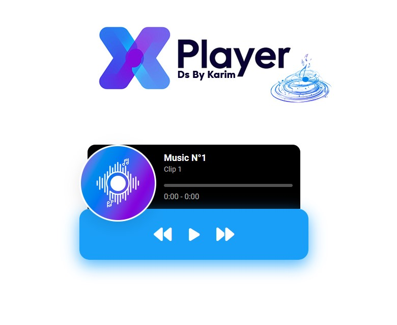
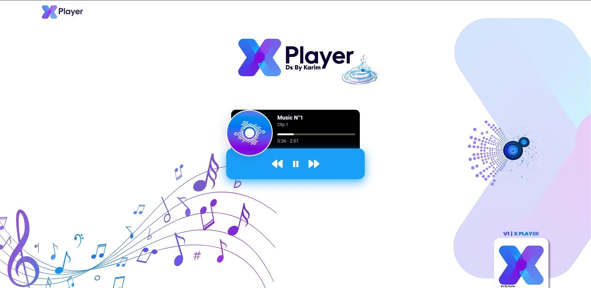

# X Music Player𝄞

<div align="center">
  
</div>

## Introduction𝄞
```
Welcome to X Music Player 🎶 , This project is a result of my passion for music and my love for coding.
Built entirely from scratch using HTML, CSS, and JavaScript, X Music Player aims to provide users with
a sleek and intuitive music player experience.
```




## Features𝄞
🔹 **Basic Structure:** The HTML file is structured to accommodate all the necessary elements of a music player, providing a solid foundation for the project.
🔹 **Stylish Design:** With CSS, I've crafted a visually appealing and user-friendly interface, ensuring that users enjoy interacting with the player.
🔹 **Interactive Functionality:** JavaScript handles play, pause, next, and previous functionalities seamlessly, offering a smooth user experience.
🔹 **Track Progress Control:** I've added features to control track progress, allowing users to easily navigate through their favorite tunes.

### Project Structure𝄞

The project has been developed according to the following structure:

```plain𝄞
/X Music Player 
  ├── index.html
  ├── style.css
  └── script.js

```

## Contributing𝄞
I welcome contributions to enhance X Music Player further. Whether it's fixing bugs, adding new features, or improving performance, your contributions are valuable to me. Please feel free to fork the repository, make your changes, and submit a pull request.


<div align="center">
   Developed ⭐️ By <a href="#">𝄞 KARIM</a>
</div>
